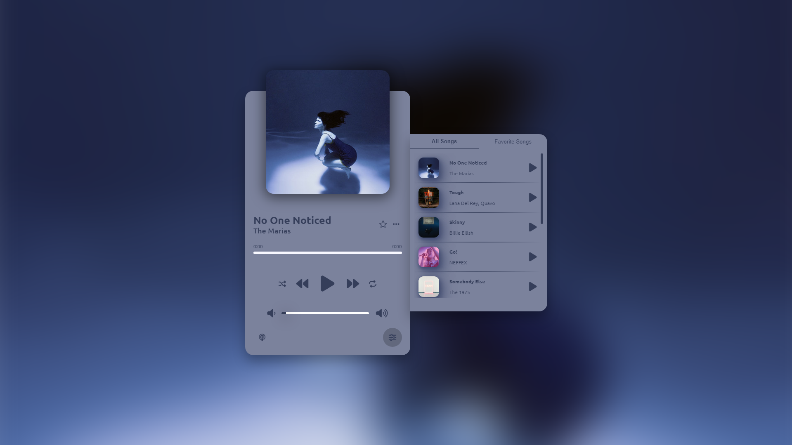

# music-player

  <h2 align="center">Web Music Player</h2>

  Responsive web music player using javascript  Responsive for all devices and built using html, css, and javascript. 
   
  
Play, pause, toggle, playlist, favorite playlist, add-remove songs from favorite playlist, finding average color of song cover and applying darker and lighter average color, updating colors every time the song changes, sync of play buttons betweeb playlist, favorite playlist and main play/pause button.

  
<a href="https://kuzguni.github.io/music-player/"><strong>➥ Live Demo</strong></a>

### Demo Screeshot

### Contact

You can reach me at [Twitter](https://x.com/Kuzguni3).

### License

This project is free to use.
